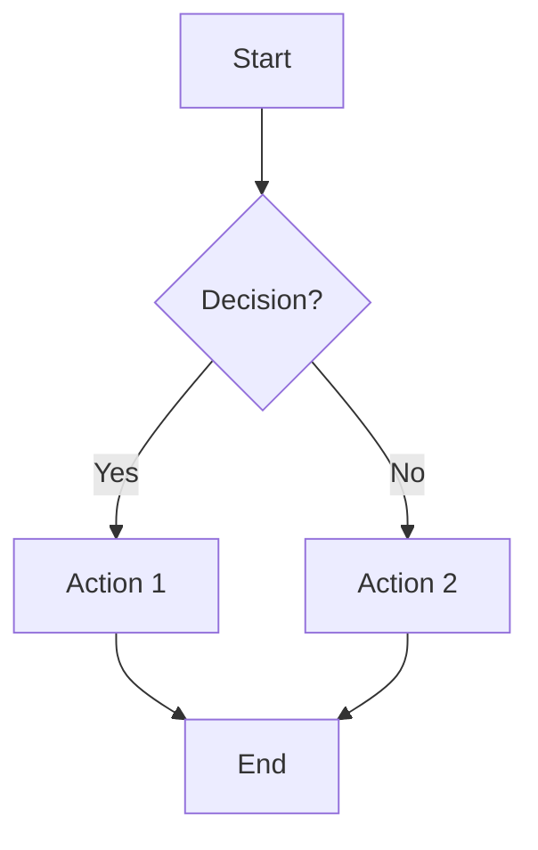
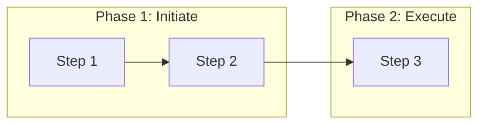

# Generate Diagram Directive

## When to Use This Directive

This directive applies when the user requests any diagram generation. The default output format is `.drawio` unless the user explicitly requests another format (mermaid, ASCII, etc.).

**Trigger phrases:** "generate diagram", "create a diagram", "make a flowchart", "visualize this process", "draw this out", etc.

## Tools Available

| Tool | Purpose | Input |
|------|---------|-------|
| `tool/generate_drawio.py` | Generate Draw.io XML | JSON file or stdin |
| `tool/generate_mermaid.py` | Generate Mermaid syntax | JSON file or stdin |
| `tool/migrate_ascii_to_mermaid.py` | Convert ASCII to Mermaid | Markdown file/directory |

## Goal

Generate diagrams from structured input or natural language descriptions, outputting to Draw.io, Mermaid, or other formats.

## Style Selection (REQUIRED)

**Before generating any Draw.io diagram, ask the user which style they prefer.** Use AskUserQuestion or ask conversationally. Available styles:

| Style | Description | Best For |
|-------|-------------|----------|
| `classic` | Light background, pastel colors | Business docs, printable diagrams |
| `dark-modern` | Dark background, vibrant saturated colors | Tech diagrams, presentations, screen viewing |

To list available styles programmatically:
```bash
./run tool/generate_drawio.py --list-styles
```

Pass the chosen style via `--style` flag or include `"style"` in the JSON input.

## Inputs

- **Diagram Type**: The kind of diagram (flowchart, process, hierarchy, swimlane, architecture, etc.)
- **Title**: Name for the diagram/file
- **Content**: Structured description of nodes, groups, and connections (or natural language)
- **Style**: Which visual style to use (ask the user if not specified)

## Process

### For Structured JSON Input

1. Validate JSON against schema (nodes, connections, optional groups)
2. Run appropriate tool:
   - Draw.io: `./run tool/generate_drawio.py input.json --style <style> --output diagram.drawio`
   - Mermaid: `./run tool/generate_mermaid.py input.json --output diagram.md`
3. Return file path

### For Natural Language Input

1. Ask the user which style they want (if not already specified)
2. Parse user description to identify:
   - Diagram type (flowchart, swimlane, hierarchy)
   - Nodes (steps, actions, decisions)
   - Groups/phases (if applicable)
   - Connections and their labels
3. Generate JSON structure matching the schema (include `"style"` field)
4. Either pass to tool OR generate XML directly using patterns below

## JSON Input Schema

```json
{
  "style": "classic|dark-modern",
  "type": "flowchart|swimlane",
  "title": "Diagram Title",
  "direction": "TD|LR",
  "groups": [
    {"id": "g1", "label": "Phase 1", "color": "blue"}
  ],
  "nodes": [
    {"id": "n1", "label": "Step 1", "group": "g1", "shape": "rectangle|diamond|ellipse|cylinder|cloud|document|hexagon|actor|process|parallelogram|callout|task|event|gateway"}
  ],
  "connections": [
    {"from": "n1", "to": "n2", "label": "Yes", "style": "solid|dashed"}
  ]
}
```

**Node shapes:**
- `rectangle` - Standard box (default)
- `diamond` - Decision point
- `ellipse` - Start/end terminal
- `cylinder` - Database or data store
- `cloud` - Cloud services
- `document` - Files and documents
- `hexagon` - Microservices, modules
- `actor` - Users/people (stick figure)
- `process` - Processing steps (side bars)
- `parallelogram` - I/O operations
- `callout` - Annotations and notes

**BPMN stencil shapes** (from Draw.io's built-in mxgraph.bpmn library):
- `task` - BPMN task with built-in marker. Add `"marker"`: `script`, `send`, `manual`, `service`, `user`, `abstract`
- `event` - BPMN event circle with symbol. Add `"symbol"`: `message`, `timer`, `error`, `conditional`, `terminate`, `general`. Add `"outline"`: `standard`, `boundInt`, `end`, `throwing`
- `gateway` - BPMN gateway diamond. Add `"gateway_type"`: `exclusive`, `parallel`, `inclusive`

## Outputs

- `.drawio` file in the workspace that opens directly in Draw.io desktop or web app
- `.md` file with Mermaid code block for Markdown embedding

## Edge Cases

- If no color scheme specified, use the default palette (blue, green, orange, red)
- If layout is ambiguous, default to top-to-bottom flow
- For large diagrams (>20 nodes), increase canvas size accordingly
- Escape special XML characters in node labels (`&`, `<`, `>`, `"`, `'`)

---

## Draw.io XML Structure

Draw.io files are XML with this structure:

```xml
<mxfile host="Electron" agent="..." version="...">
  <diagram name="Diagram Name" id="unique-id">
    <mxGraphModel dx="1306" dy="898" grid="1" gridSize="10" guides="1" tooltips="1" connect="1" arrows="1" fold="1" page="1" pageScale="1" pageWidth="1200" pageHeight="800" math="0" shadow="0">
      <root>
        <mxCell id="0" />
        <mxCell id="1" parent="0" />
        <!-- All diagram elements go here -->
      </root>
    </mxGraphModel>
  </diagram>
</mxfile>
```

### Cell Types

**1. Basic Shape (Rectangle/Box)**
```xml
<mxCell id="unique-id" value="Label Text" style="rounded=1;whiteSpace=wrap;html=1;fillColor=#fff;strokeColor=#6c8ebf;" parent="1" vertex="1">
  <mxGeometry x="20" y="45" width="200" height="40" as="geometry" />
</mxCell>
```

**2. Swimlane/Group Container**
```xml
<mxCell id="group-id" value="GROUP TITLE" style="swimlane;horizontal=1;startSize=30;fillColor=#dae8fc;strokeColor=#6c8ebf;rounded=1;fontStyle=1;fontSize=14;" parent="1" vertex="1">
  <mxGeometry x="40" y="40" width="240" height="200" as="geometry" />
</mxCell>
<!-- Child elements use parent="group-id" and relative positioning -->
```

**3. Connector/Arrow**
```xml
<mxCell id="arrow-id" style="edgeStyle=orthogonalEdgeStyle;rounded=1;orthogonalLoop=1;jettySize=auto;html=1;strokeWidth=2;strokeColor=#666;" parent="1" source="source-id" target="target-id" edge="1">
  <mxGeometry relative="1" as="geometry" />
</mxCell>
```

**4. Labeled Arrow**
```xml
<mxCell id="labeled-arrow" value="Arrow Label" style="edgeStyle=orthogonalEdgeStyle;rounded=1;..." parent="1" source="source-id" target="target-id" edge="1">
  <mxGeometry relative="1" as="geometry" />
</mxCell>
```

**5. Arrow with Custom Path (for loops/cycles)**
```xml
<mxCell id="cycle-arrow" value="Cycle Label" style="edgeStyle=orthogonalEdgeStyle;rounded=1;dashed=1;dashPattern=8 8;" parent="1" source="source-id" target="target-id" edge="1">
  <mxGeometry relative="1" as="geometry">
    <Array as="points">
      <mxPoint x="1000" y="280" />
      <mxPoint x="160" y="280" />
    </Array>
  </mxGeometry>
</mxCell>
```

---

## Color Palette

Colors are defined per style in `styles/*.json`. Each color name (blue, green, orange, etc.) maps to fill, stroke, and font colors appropriate for that style's background.

**Classic style** (light background, pastel fills):

| Name | Fill | Stroke | Use Case |
|------|------|--------|----------|
| blue | `#dae8fc` | `#6c8ebf` | Phase 1, Primary |
| green | `#d5e8d4` | `#82b366` | Phase 2, Success |
| orange | `#ffe6cc` | `#d79b00` | Phase 3, Warning |
| red | `#f8cecc` | `#b85450` | Phase 4, Error |
| purple | `#e1d5e7` | `#9673a6` | Loops, Cycles |
| gray | `#f5f5f5` | `#666666` | Neutral |

**Dark Modern style** (dark background, vibrant saturated fills with white text):

| Name | Fill | Stroke | Use Case |
|------|------|--------|----------|
| blue | `#2196F3` | `#1565C0` | Primary, APIs |
| green | `#4CAF50` | `#2E7D32` | Success, Active |
| orange | `#FF9800` | `#E65100` | Functions, Handlers |
| red | `#F44336` | `#C62828` | Errors, Alerts |
| charcoal | `#37474F` | `#263238` | Data stores, Databases |
| teal | `#009688` | `#00695C` | Services, Integrations |
| amber | `#FFC107` | `#FF8F00` | Warnings (dark text) |

---

## Common Style Properties

**Shapes:**
- `rounded=1` - Rounded corners
- `rounded=0` - Sharp corners
- `whiteSpace=wrap` - Text wrapping
- `html=1` - Enable HTML in labels
- `fontStyle=1` - Bold text
- `fontStyle=2` - Italic text
- `fontSize=14` - Font size

**Connectors:**
- `edgeStyle=orthogonalEdgeStyle` - Right-angle connections
- `edgeStyle=elbowEdgeStyle` - Single elbow
- `curved=1` - Curved lines
- `strokeWidth=2` - Line thickness
- `dashed=1;dashPattern=8 8` - Dashed line
- `endArrow=classic` - Arrow head (default)
- `endArrow=none` - No arrow head

**Swimlanes:**
- `swimlane` - Container type
- `horizontal=1` - Horizontal orientation
- `startSize=30` - Header height

---

## Layout Guidelines

**Positioning:**
- Grid size: 10px (align to grid)
- Standard node: 200w x 40h
- BPMN task: 120w x 80h, event: 50x50, gateway: 50x50
- Group/swimlane: 280w x auto-height (adjusts to content)
- Horizontal spacing between groups: 60px gap
- Vertical spacing within groups: 20px gap
- Canvas default: 1200w x 800h (expands for larger diagrams)

**Auto-centering:** Nodes are automatically centered within their containers:
- In swimlanes: nodes center horizontally within the group width
- In LR flowcharts: nodes center vertically on a shared baseline
- In TD flowcharts: nodes center horizontally relative to the widest node

**Bottom-label shapes:** Event, gateway, and actor shapes render their labels below the shape body (via `verticalLabelPosition=bottom`). The layout engine adds 25px extra vertical padding after these shapes to prevent labels from overlapping the next node.

**Swimlane height equalization:** All groups in a swimlane diagram are set to the same height (the tallest group's height) for uniform appearance.

**Hierarchy:**
- `id="0"` - Root (always present)
- `id="1"` - Default parent (always present, `parent="0"`)
- Groups: `parent="1"`
- Nodes in groups: `parent="group-id"`, positions relative to group
- Connectors: `parent="1"`, reference source/target by id

---

## Mermaid Syntax Reference

### Basic Flowchart


### Shapes
- `[Text]` - Rectangle
- `{Text}` - Diamond (decision)
- `([Text])` - Rounded rectangle (start/end)
- `[[Text]]` - Subroutine
- `((Text))` - Circle

### Arrow Styles
- `-->` - Solid arrow
- `-.->` - Dashed arrow
- `-->|label|` - Labeled arrow

### Subgraphs (Swimlanes)


---

## Quick Generation Patterns

**Simple Flowchart (no groups):**
```json
{
  "type": "flowchart",
  "title": "Simple Flow",
  "nodes": [
    {"id": "start", "label": "Start", "shape": "ellipse"},
    {"id": "process", "label": "Process"},
    {"id": "end", "label": "End", "shape": "ellipse"}
  ],
  "connections": [
    {"from": "start", "to": "process"},
    {"from": "process", "to": "end"}
  ]
}
```

**Swimlane Process (with groups):**
```json
{
  "type": "swimlane",
  "title": "Business Process",
  "groups": [
    {"id": "phase1", "label": "PHASE 1", "color": "blue"},
    {"id": "phase2", "label": "PHASE 2", "color": "green"}
  ],
  "nodes": [
    {"id": "step1", "label": "Step 1", "group": "phase1"},
    {"id": "step2", "label": "Step 2", "group": "phase1"},
    {"id": "step3", "label": "Step 3", "group": "phase2"}
  ],
  "connections": [
    {"from": "step1", "to": "step2"},
    {"from": "step2", "to": "step3"}
  ]
}
```

**BPMN Process (with stencil shapes):**
```json
{
  "type": "flowchart",
  "title": "Order Processing",
  "direction": "LR",
  "nodes": [
    {"id": "start", "label": "Order Received", "shape": "event", "symbol": "message"},
    {"id": "check", "label": "Check Availability", "shape": "task", "marker": "script"},
    {"id": "decide", "label": "In Stock?", "shape": "gateway", "gateway_type": "exclusive"},
    {"id": "pack", "label": "Pack Items", "shape": "task", "marker": "manual"},
    {"id": "done", "label": "", "shape": "event", "symbol": "terminate", "outline": "end"}
  ],
  "connections": [
    {"from": "start", "to": "check"},
    {"from": "check", "to": "decide"},
    {"from": "decide", "to": "pack", "label": "Yes"},
    {"from": "pack", "to": "done"}
  ]
}
```

---

## Learnings & Edge Cases

*(Updated as issues are discovered)*

- Draw.io expects `mxCell id="0"` and `mxCell id="1"` as the first two cells (mandatory root structure)
- Child elements in groups use coordinates relative to the group's origin, not the canvas
- Connector `source` and `target` must reference existing cell IDs
- For arrows that need to wrap around (like cycle/loop arrows), use explicit `<Array as="points">` waypoints
- **Connector overlap fix:** Small node gaps (10px) cause connectors to route through adjacent nodes. The layout engine uses 20px gaps plus 25px extra padding for bottom-label shapes (event, gateway, actor) to give connectors room to route cleanly
- **Node centering:** Fixed-position nodes (e.g., all at x=20) in wide swimlanes create cramped layouts. The engine now centers nodes horizontally within groups based on the node's width vs group width
- **Swimlane uniformity:** All swimlane groups are equalized to the tallest group height so the diagram looks consistent
- **Smart edge routing:** Draw.io's orthogonal edge router doesn't avoid nodes in different parent groups. The engine handles three routing scenarios:
  - *Intra-group edges*: parent set to the group cell so Draw.io avoids sibling nodes
  - *Forward cross-group edges*: exit right (`exitX=1;exitY=0.5`), enter left (`entryX=0;entryY=0.5`) to route through gaps between swimlanes
  - *Backward cross-group edges* (loops/retries): exit bottom, enter bottom, with explicit waypoints that route below all swimlanes to avoid cutting through intermediate groups
  - *Intra-group skip-node edges*: when a connection skips over intermediate nodes (e.g., gateway → node C, bypassing node B between them), waypoints route the connector to the right side of the group to avoid cutting through obstacles

